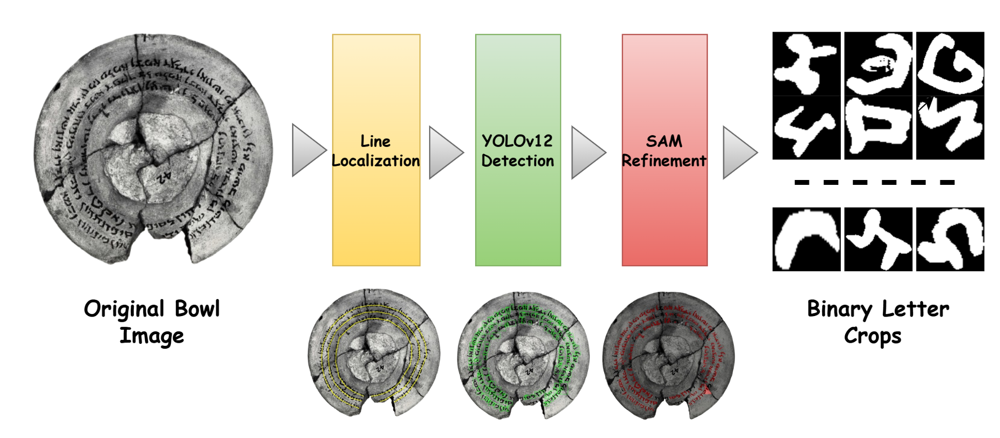
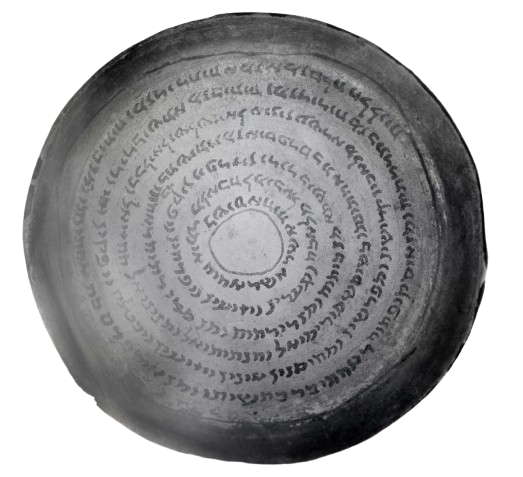
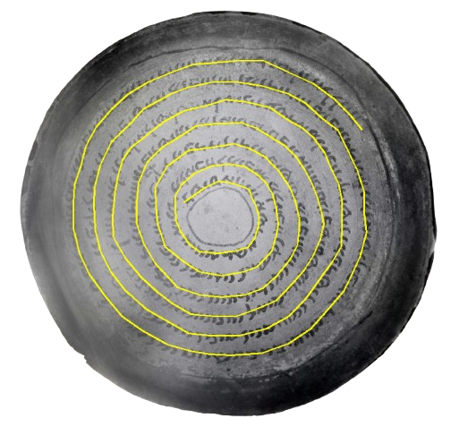
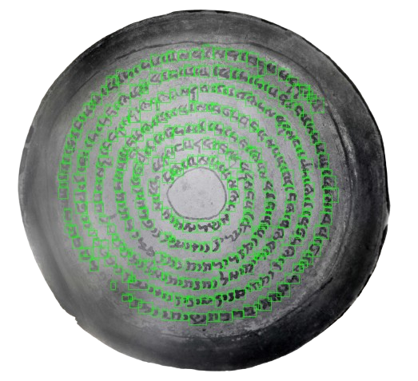
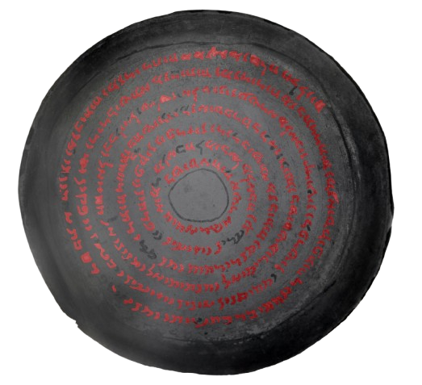

# Aramaic Bowls Annotation Pipeline

<p align="center">
  
</p>

<p align="center">
  <a href="https://ssl-aramaic-bowls.github.io/"><b>Project Page</b></a> ·
  <a href="https://ssl-aramaic-bowls.github.io/"><b>Dataset Page</b></a> ·
  <b>Paper: Coming Soon</b>
</p>

Clean, reproducible code for constructing a letter-level dataset from Aramaic incantation bowl images.

The pipeline follows the dataset-construction workflow used in the accompanying paper:

> **Beyond Labels: Visual Invariance in Self-Supervised Learning for Aramaic Bowls**

It supports:

- mask-guided patch generation from high-resolution bowl images;
- YOLO-based letter proposal detection on patches;
- conversion of patch detections back to full-image coordinates;
- area, mask-overlap, and IoU-based post-processing;
- SAM-based mask refinement for detected letter regions;
- connected-component splitting into individual letter instances;
- export of letter crops, binary masks, YOLO labels, JSON metadata, and visual summaries.

No dataset images, YOLO weights, or SAM checkpoints are included in this repository.

---

## Overview

This repository provides the code used to transform high-resolution bowl imagery into isolated letter-level instances. The full workflow is:

```text
Original bowl image
        ↓
Text-line / baseline localization
        ↓
Patch generation over relevant text regions
        ↓
YOLO-based letter proposal detection
        ↓
Post-processing and coordinate merging
        ↓
SAM-based mask refinement
        ↓
Letter crops, binary masks, metadata, and visual summaries
```

<p align="center">
  
  
  
</p>

<p align="center">
  
</p>

---

## Repository Structure

```text
aramaic-bowls-annotation-pipeline/
├── aramaic_bowls_pipeline/
│   ├── pipeline.py              # main YOLO + SAM dataset pipeline
│   ├── patching.py              # mask-guided patch generation
│   ├── detection.py             # YOLO inference utilities + post-processing
│   ├── sam_wrapper.py           # thin wrapper around Segment Anything
│   ├── sam_postprocess.py       # SAM mask cleanup + letter instance export
│   ├── visualization.py         # visualization utilities
│   ├── summarize_dataset.py     # processed dataset summary script
│   ├── classical_proposals.py   # optional classical baseline proposal generator
│   └── io_utils.py              # file and image I/O helpers
├── configs/default.yaml         # reference default configuration
├── scripts/run_pipeline.sh      # example full run command
├── scripts/summarize_dataset.sh # example summary command
├── docs/                        # input/output structure documentation
│   └── assets/                  # README figures and visual examples
├── examples/                    # placeholder for tiny demo data
├── requirements.txt
├── environment.yml
├── pyproject.toml
├── CITATION.cff
└── LICENSE
```

---

## Installation

### Option 1: pip environment

```bash
python -m venv .venv
source .venv/bin/activate
pip install -U pip
pip install -r requirements.txt
pip install git+https://github.com/facebookresearch/segment-anything.git
pip install -e .
```

### Option 2: conda environment

```bash
conda env create -f environment.yml
conda activate aramaic-bowls-pipeline
pip install -e .
```

---

## Expected Input Layout

```text
data/example_dataset/
├── raw/
│   ├── bowl_001.jpg
│   └── bowl_002.jpg
└── masks/
    ├── bowl_001_mask.png
    └── bowl_002_mask.png
```

The mask should mark the text/baseline region. If no matching mask is found, the pipeline can still run, but patch extraction will not be mask-guided.

---

## Running the Full Pipeline

```bash
python -m aramaic_bowls_pipeline.pipeline \
  --dataset_root data/example_dataset \
  --images_dirname raw \
  --masks_dirname masks \
  --output_root outputs/processed_dataset \
  --yolo_weights checkpoints/yolo_letters.pt \
  --sam_checkpoint checkpoints/sam_vit_h.pth \
  --sam_model_type vit_h \
  --sam_device cuda \
  --patch_size 512 \
  --stride 256 \
  --min_mask_ratio 0.01 \
  --yolo_conf 0.25 \
  --min_box_area 200 \
  --max_box_area 60000 \
  --min_mask_overlap 0.1 \
  --nms_iou 0.4 \
  --min_component_area 20
```

For a quick debugging run:

```bash
python -m aramaic_bowls_pipeline.pipeline \
  --dataset_root data/example_dataset \
  --output_root outputs/debug_run \
  --yolo_weights checkpoints/yolo_letters.pt \
  --sam_checkpoint checkpoints/sam_vit_h.pth \
  --limit_images 1
```

---

## Output Layout

For each input image, the pipeline creates:

```text
outputs/processed_dataset/<image_id>/
├── patches/
├── annotations/
├── letters/
│   ├── images/
│   └── masks/
└── visualizations/
    └── pipeline_overview.png
```

The dataset-level summary is saved as:

```text
outputs/processed_dataset/summary.csv
outputs/processed_dataset/summary.json
```

See [`docs/output_structure.md`](docs/output_structure.md) for the full output tree.

---

## Summarizing a Processed Dataset

```bash
python -m aramaic_bowls_pipeline.summarize_dataset \
  --root outputs/processed_dataset \
  --out_dir outputs/dataset_summary
```

This generates:

```text
outputs/dataset_summary/dataset_summary.csv
outputs/dataset_summary/dataset_summary.txt
```

---

## Optional Classical Proposal Baseline

A non-deep classical proposal generator is included for bootstrapping/debugging:

```bash
python -m aramaic_bowls_pipeline.classical_proposals \
  --image data/example_dataset/raw/bowl_001.jpg \
  --mask data/example_dataset/masks/bowl_001_mask.png \
  --out_vis outputs/classical/bowl_001_vis.png \
  --out_yolo outputs/classical/bowl_001.txt \
  --min_area 300 \
  --max_area 50000 \
  --min_mask_overlap 0.1
```

This is not the main pipeline; it is provided as a lightweight baseline or annotation bootstrap.

---

## Model Checkpoints

This repository does **not** include model weights.

You need to provide:

1. a trained YOLO checkpoint for letter proposal detection, e.g. `checkpoints/yolo_letters.pt`;
2. a Segment Anything checkpoint, e.g. `checkpoints/sam_vit_h.pth`.

SAM checkpoints should be obtained from the official Segment Anything release.

---

## Notes on Data and Licensing

- Historical image rights may depend on the source institution or collection.
- Do not commit restricted images, model checkpoints, or processed outputs unless the license allows redistribution.
- The `.gitignore` intentionally excludes `data/`, `outputs/`, `models/`, `checkpoints/`, `*.pt`, and `*.pth`.

---

## Citation

If you use this code, please cite the accompanying paper:

```bibtex
@inproceedings{atamni2026beyondlabels,
  title     = {Beyond Labels: Visual Invariance in Self-Supervised Learning for Aramaic Bowls},
  author    = {Atamni, Nour and Madi, Boraq and Ammar, Islam and El-Sana, Jihad},
  year      = {2026},
  note      = {Code repository: Aramaic Bowls Annotation Pipeline}
}
```
